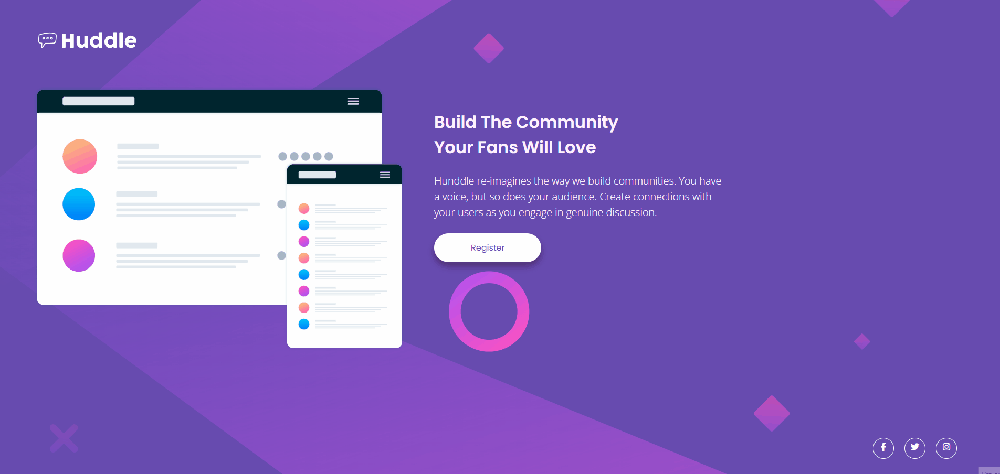

# Hello There 👋

This is a front-end coding challenge from [Frontend Mentor](https://www.frontendmentor.io) challeged by DevEmDobro. 

## The challenge

  

My challenge was to build out this landing page from the designs provided above. 

The landing page must be viewable regardless of the screen size. So this page has to be responsive. 

## Technologies and tools used

* HTML
* CSS
  * FLEXBOX